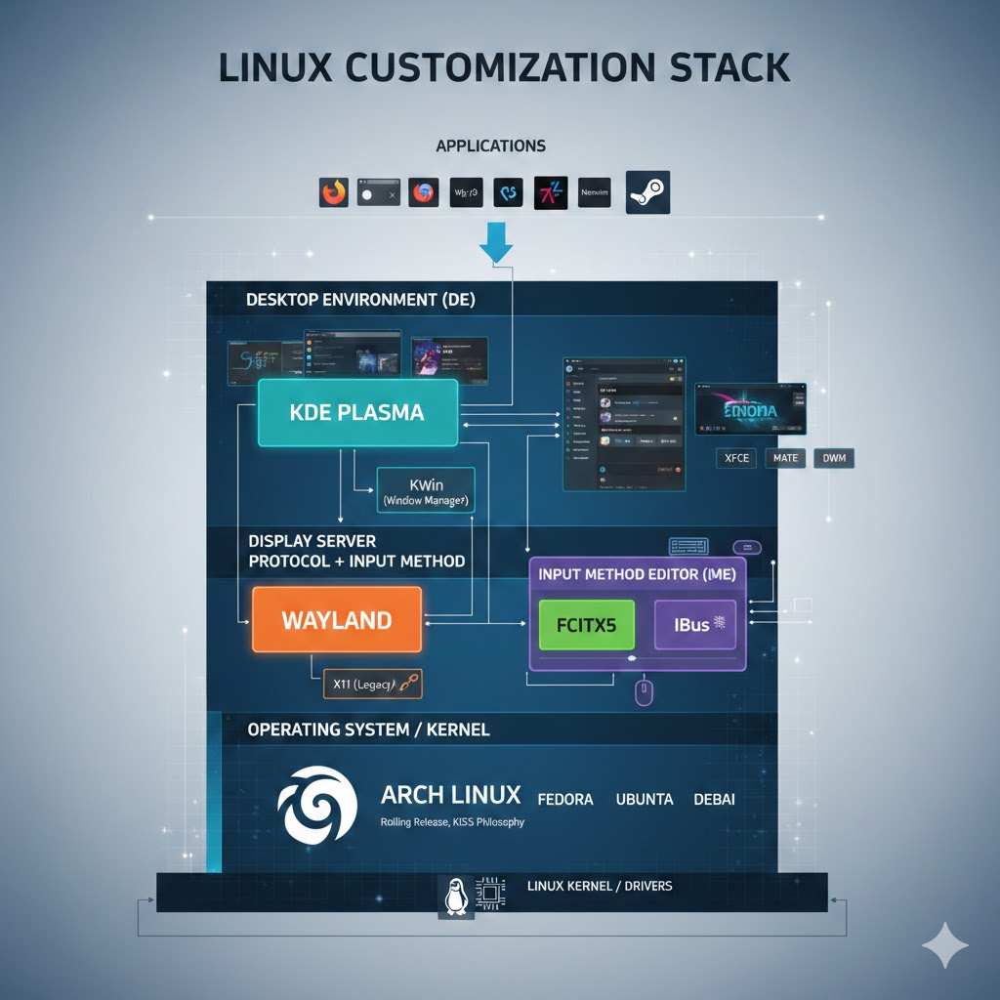
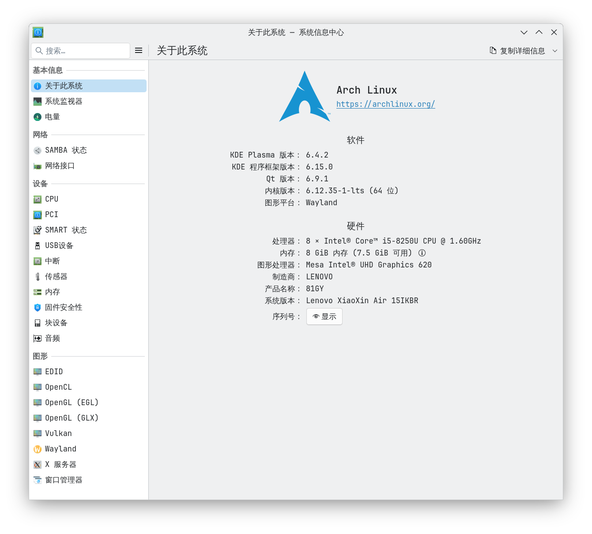
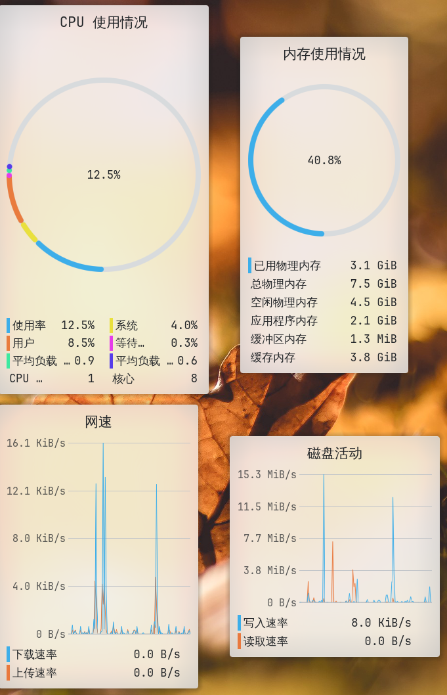

## 前因

去年毕业的暑假还是啥时候？

瞎折腾了一台大学第二年(2019.9)购置的笔记本(联想小新)到一个 archlinux，但并没有记录，导致很多过程和细节原因我都记不起来了。

整体装 arch linux 似乎没有遇到太多问题。主要是显卡设置上，似乎是有核显+一个垃圾独显，垃圾独显并没有办法丝滑同时双显卡使用。

但问题不大，整体算是能用。

## 使用

几乎是可以获得和 win 差不多的体验，同时各种东西都可以定制，看着很爽

涉及到很多名词

让 AI 帮我理了一张图

桌面环境：
KDE Plasma

通信协议：
Wayland, 更简单更流畅的桌面程序渲染通信协议

前身是 X Window System(X11), 看到的很多 xorg 之类的就是该协议带来的?

{}
Wayland 并不是一个具体的软件，而是一套通信协议。

它定义了混成器（Compositor）（比如 Hyprland、Sway 或 GNOME 的 Mutter）与应用程序之间如何交流。它的核心目标是让渲染变得更简单、更安全、更流畅。

    它的口号： "Every frame is perfect"（每一帧都完美）。

    最大的特点： 消除了画面撕裂（Tearing），并且从架构上实现了应用隔离（比前辈更安全）。
---gemini 3.0 flash
{}

输入法：
fcitx5

26年春节这几天顺带解决了 qq，vscode 输入法漏字的问题，大抵是启动的默认协议和 wayland 不兼容的问题，需要额外启动参数设置调整。

能探索的东西十分的多，可以有软件级别的对各种硬件参数的了解

同时可以监控每时每刻设备的状态

这真的很酷

## 接轨 AI

想装个 openclaw 配一些 chat bot 玩一下，但并无可用 api，只能暂时作罢。

## 结束语

人无再少年

下次探索不知道是何时了
