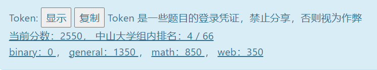

> 听群友强烈安利 CTF 比赛，本来是本着随便打打的心情，但实际过程中非常的上头，经常是在实验室或者寝室整个时段的时间全在读一个 doc ，搜某个内容，非常上头
>  
> 评价是确实是非常的好玩！学到许多！
>  
> 特别是 web 相关，本来都是很离散的了解，似乎具体了许多
>  
> 主要实在是 binary 汇编和 ELF 相关完全不会，于是 0 分了...
>  
> 作为前 acm 选手感觉 math 题相对来说可做许多...



<!-- 同步发表于[我的博客](https://zztrans.github.io/p/hackergame2022/) -->

{}
未特别标注的源代码采用 [知识共享署名-非商业性使用-相同方式共享 4.0 国际许可协议](http://creativecommons.org/licenses/by-nc-sa/4.0/) 进行许可
{}

## 签到

刚开始小小坐牢，F12 尝试改改 js，但是没法让他作用，刷新就会消失。后来发现结果是通过 `url` 的 `query` 形式传递，改成 2022 就拿到了。

{}
赛后学会可以在 js 里加断点再改 timelimits，让他在被浏览器运行前成功作用。
{}

## 猫咪问答喵

1. 谷歌搜索得到 [这个](https://cybersec.ustc.edu.cn/2022/0826/c23847a565848/page.htm)
2. 谷歌搜索得到 [这个](https://lug.ustc.edu.cn/wiki/lug/events/sfd/)，从 PPT 图片中按关键字+KDE 可以进一步搜索到答案
3. 谷歌搜索得到，当然也可以爆破
4. 尝试把 linux-kernel 源码 `git clone` 下来，深入学习了 `git log` 的一些参数，自己瞎编了一堆好多关键词，类似 `git log --grep="not allow" --grep="argc" --grep="0" -i --all-match --no-merges --reverse`，实际会搜出来许多 commit 完全没法判断。最后认真审题其实只需要题目里的关键字 `git log --pretty=oneline --grep="PwnKit" --no-merges --reverse`，发现符合的只有一条 commit。赛后学会可以不用 `clone` 到本地，直接在 github 里搜索 `commit` 即可。
5. 没啥搜索思路，刚开始以为值域很大，但后来又加了提示，发现顶级域名固定，其他就三个可变的值域，通过枚举顶级域名，尝试了 `.com && .edu && .org` 就出来了，只能说幸好答案不是 `.cn`。赛后发现只需完整匹配或者在 github 上搜索通过 fingerprint 定位 IP，问 DNS 即可。
6. 同样通过爆破得到，值域很小。

爆破代码，从官方给的之前的题解里 modify 来的，粗略估计大概一秒 query15 到 20 次？还想学下多线程或者多进程的爆破？

{}

```python
from time import time
import requests
import datetime
import string
def main():
    s = requests.Session()
    s.get("http://202.38.93.111:10002/?token=?")
    print(f'{s=}')
    # date = datetime.date(2003, 12, 31)  # 从 2017/12/31 开始向前推
    # print(f'{date=}')
    # delta = datetime.timedelta(days=1)
    lists=[]
    alphaSet=[]
    # ends=["org","edu"]
    # for top in ends:
    for a in string.ascii_lowercase:
        if a=='o' or a=='r' or a=='g':
            continue
        alphaSet.append(a)
    print(len(alphaSet))
    for x in alphaSet:
        if x < 'f':
             continue
        for y in alphaSet:
            for z in alphaSet:
                    if x==y or y==z or x==z:
                        continue
                    lists.append(x+y+z)
    length=len(lists)
    start=time()
    idx=0
    while True:
        # datestr = date.strftime("%Y-%m-%d")
        domain=lists[idx]+".org"
        ret = s.post("http://202.38.93.111:10002/", {
            "q1": "2017-03",
            "q2": "Kdenlive",
            "q3": "12",
            "q4": "",
            "q5": "sdf.org",
            "q6": "2003-03-01"
        })
        # print(f'{ret=}')
        # print(f'{ret.text=}')
        if "答对了 4 题" in ret.text:
            # pass
            print(domain, "❌")
        else:
            print(domain, "✅")
            break
        # date = date - delta
        idx+=1
        if idx>=length:
            break
    end=time()
    print(f'time : {end-start}')

if __name__ == '__main__':
    main()
```

{}

## 家目录里的秘密

1. 直接 `grep` 即可
2. 显然通过文件定位到 `rclone.conf`，读一下 doc 发现这种形式依然是不安全的，就搜索了一下，找不到命令还原 password，但有人提过这个 [问题](https://forum.rclone.org/t/how-to-retrieve-a-crypt-password-from-a-config-file/20051)，直接就能解码。

## HeiLang

vscode 替换 `|` 到 `] = t;` 即可

## Xcaptcha

写了简单的 js，手速快贴进去即可。

{}

```javascript
var x=document.getElementsByTagName('label')
for(var i=0;i<x.length;i++) {
    var text=x[i].innerText
    var len=text.length
    var str=text.substring(0,len-6)
    var list=str.split('+')
    var a=BigInt(list[0])
    var b=BigInt(list[1])
    var ans=a+b
    var idx="captcha"+String(i+1)
    document.getElementById(idx).value=ans
}

document.getElementById('submit').click();
```

{}

## 旅行照片 2.0

1. 都在 exif 里
2. 放大图片可以定位是 `ZOZO Marine Stadium`，周围的酒店的邮编通过谷歌地图能大致找到几个可疑。机场搜了很久，似乎很难找到查历史飞行记录的，大部分都是付费内容，最终 [flightradar24]([flightradar24](https://www.flightradar24.com/))试用会员可以回放成功找到，最后枚举了一下邮编就过了。

## 猜数字

同时满足条件的数只有猜对和异常情况，数据类型的异常情况是 `NaN`，控制台造了报文 post 就过了。

{}
赛后学到可以删掉数字，去前端按钮的 disable 就行
{}

## LaTeX 机器人

1. 搜了怎么嵌入文件，`\input{/flag1}` 即可，不知道为啥 `\include` 烂掉了。

## 安全的在线测评

1. 已知这个问题目前肯定是不可能在题给时限下运算破解的，静态直接尝试读文件居然就过了。看 flag 的提示发现预期解是要编译器 `include` 之类的。

## 线路板

搜到一些在线的 viewer，发现在 `ebaz_sdr-F_Cu.gbr` 有 flag 的痕迹但是被挡住，想找到一个 editor 能删那些圆未果，但搜到一个高级的 [viewer](https://app.pcbflow.com/) 丢进去就过了，没做啥处理，感觉是非预期的...

## 蒙特卡罗轮盘赌

发现大概能 attack 的地方只能是随机种子了，`time()` 运行差异是逐秒递增 1 的，几乎只取决于时钟差异 `clock()`，本地测大概在 `500~1000` 左右，于是本地枚举了 clock 到几 k，先送一把不行发现得送两把，本地能够对上已知前两个一样的情况下，后三个就稳了。

{}

```C
#include <stdio.h>
#include <stdlib.h>
#include <time.h>
#include <string.h>
double rand01() {
    return (double)rand() / RAND_MAX;
}
//3.14159
int main(int argc,char * argv[]) {
    // disable buffering
    setvbuf(stdin, NULL, _IONBF, 0);
    setvbuf(stdout, NULL, _IONBF, 0);
    setvbuf(stderr, NULL, _IONBF, 0);
    for(int a=0;a<20000;++a) {
        srand(1666925483+a);
        int games = 5;
        int win = 0;
        int lose = 0;
        char target[20];
        char guess1[2000]="3.14124";
        guess1[7] = '\0';
        char guess2[2000]="3.13848";
        guess2[7] = '\0';
        int flag=0;
        for (int i = games; i > 0; i--) {
            int M = 0;
            int N = 400000;
            for (int j = 0; j < N; j++) {
                double x = rand01();
                double y = rand01();
                if (x*x + y*y < 1) M++;
            }
            double pi = (double)M / N * 4;
            sprintf(target, "%1.5f", pi);
            // printf("请输入你的猜测（如 3.14159，输入后回车）：");
            // fgets(guess, 2000, stdin);
            if (i==5 && strcmp(target, guess1) == 0) {
                win++;
                printf("%d 猜对了！\n",i);
                flag=1;
                // exit(1);
            } else if(i==4 && flag==1 && strcmp(target,guess2)==0) {
                win++;
                printf("%d 猜对了！\n",i);
                flag=2;
            }
            else {
                lose++;
                printf("猜错了！\n");
                printf("%d 正确答案是：%1.5f\n",i, pi);
            }
            if (win >= 3 || lose >= 3) break;
        }
        if(flag==2) exit(1);
        printf("-------\n");
        if (win >= 3) {
            printf("胜利！\n");
        }
    }
    return 0;
}
```

{}

## 惜字如金

### HS384

读完把给的代码按常识扩充，基本就发现难度在把 11 的 `secret` 扩成 39，这可以用 `dfs` 来做。一开始最后的 `check` 想烂了，`split` 采用按两部分的长度，其实应该是按数字。最后很粗糙的写了个 `LCS`，实际上正则表达式或者别的一些方法会更快。

我 python 写的好长好丑...

{}

```python
from hashlib import sha384

def lcs(str1):
    n=len(str1)
    dp=[[0]*(m+1)]*(n+1)
    for i in range(n):
        for j in range(m):
            if str1[i]==str2[j]:
                dp[i+1][j+1]=dp[i][j]+1
            else:
                dp[i+1][j+1]=max(dp[i+1][j],dp[i][j+1])
        if (n-i-1)+dp[i+1][m]<m:
            break
    if cnt<10:
        print(f'{str1=}')
        print(f'{dp[n][m]=}')
    return dp[n][m]

def HashSplit(str):
    hashStr=sha384(bytes(str,encoding='UTF-8')).hexdigest()
    assert(len(hashStr)==96)
    return True if lcs(hashStr)==m else False

# 'ussssstttttcccccc[e].eddddddu.cccccnnnnnn[e]'
def design():
    str=""
    str+='u'
    str+='s'*(cur[0]+1)
    str+='t'*(cur[1]+1)
    str+='c'*(cur[2]+1)
    str+="e"*(cur[3])
    str+="."
    str+="e"
    str+="d"*(cur[4]+1)
    str+="u"
    str+="."
    str+="c"*(cur[5]+1)
    str+="n"*(cur[6]+1)
    str+="e"*(cur[7])
    assert(len(str)==39)
    return str

def dfs(item,mx):
    global cnt
    if item>=8:
        if mx>0:
            return
        origin=design()
        if(cnt<10):
            print(f'{origin=}')
        if HashSplit(origin):
            print(f"!! answer={origin}")
        cnt=cnt+1
        return
    for i in range(min(up[item],mx),-1,-1):
        cur[item]=i
        dfs(item+1,mx-i)
        cur[item]=0

def main():
    dfs(0,28)
    print(f'{cnt=}')

if __name__ == '__main__':
    up=[28,28,28,1,28,28,28,1]
    cur=[0,0,0,0,0,0,0,0]
    cnt=0
    str2='ec18f9dbc4aba825c7d4f9c726db1cb0d0babf47fa170f33d53bc62074271866a4e4d1325dc27f644fdad'
    m=len(str2)
    target=['a','e','i','o','u']

    main()
```

{}

## 置换魔群

### 置换群上的 RSA

比赛最后一天才开这题，刚开始在考虑在轮换形式上做，发现很麻烦。不如直接在原来的置换形式上做，既然有 $F^e=G$ ，$ord(G)$ 容易求得，由 `RSA` 求 $d$ 满足 $ed=1\mod ord(G)$ ，用 `exgcd` 求逆即可，$F^{ed}=G^d=F$。

刚开始尝试每次手动复制进去，发现总会烂，是因为 tty 内有单次输入字节长度 `4096` 限制？最后还是学了 pwn 的交互，赛中的版本写的又臭又长...

带交互的见下题，只贴了运算部分

{}

```python
    from gmpy2 import invert
    n = TBD
    An = permutation_group(n)
    encrypted=[...]   
    perm_element=An(encrypted)
    ord=perm_element.order()
    # print(ord)
    d=invert(e,ord)
    # print(f'{d=}')
    ans=(perm_element**d).permutation_list
```

{}

### 置换群上的 DH

考虑在分解的轮换上做，看给的代码发现密钥介于阶以内，对每个轮换都有一个前后变换的距离，那么用中国剩余定理即可得到答案，比赛结束前一小时 rush，没 rush 出来，赛后半小时才拿到 flag...

精简后的代码

{}

```python
from pwn import *
from permutation_group import permutation_element, permutation_group
from ast import literal_eval
import gmpy2

def excrt(r,m):
    n=len(r)
    mod=m[0]
    re=r[0]
    for i in range(1,n):
        (d,x,y)=gmpy2.gcdext(mod,m[i])
        if (r[i]-re)%d!=0:
            return -1
        x=(r[i]-re)//d*x%(m[i]//d)
        re=re+x*mod
        mod=mod//d*m[i]
        re=re%mod
    re=(re+mod)%mod
    return re

def main():
    r=remote('202.38.93.111',10114)
    r.recvuntil(b'token: ')
    r.sendline(open('../token.txt').read().encode('UTF-8'))
    x=r.recvuntil(b'choice: ')
    print(f'{x=}')
    r.sendline(b'2')

    for i in range(15):
        print(i)
        r.recvuntil(b'n = ')
        n = int(r.recvuntil(b',').decode()[:-1])
        print(f'{n=}')

        r.recvuntil(b'g = ')
        g = permutation_element(n,literal_eval(r.recvline().strip().decode()))

        r.recvuntil(b'key = ')
        mypub = literal_eval(r.recvline().strip().decode())

        b=[]
        m=[]
        for i,tup in enumerate(g.standard_tuple):
            m.append(len(tup))
            pos=tup.index(mypub[tup[0]-1])
            b.append(pos)
        ans=excrt(b,m)
        print(ans)
        result= str(ans)
        r.recv()
        r.sendline(result.encode(encoding='UTF-8'))
        output=r.recvline()
        print(f'{output.decode()=}')
    
    output=r.recvline()
    print(f'{output.decode()=}')

if __name__ == '__main__':
    main()
```

{}

## 企鹅拼盘

### 这么简单我闭眼都可以

虽然一开始看不懂题目搞了啥，但可以调整的只有输入，于是枚举 16 种情况就拿到了。

{}
确实是闭眼都可以
{}

### 大力当然出奇迹啦~

延续上一题思路发现也只要 $2^{16}$ 下，但不可能手动调整，需要写代码，刚开始考虑写 js，发现按键或者绑定变量很难受。于是为什么不在本地做，把代码搞到本地，用给的 `Board` 类读懂逻辑稍微改下就能模拟出来。

{}
确实是大力出奇迹
{}

贴个主要的代码

{}

```python
def chal(bitlength, obf):
    filename = f'chals/b{bitlength}{"_obf" if obf else ""}.json'
    with open(filename) as f:
        branches = json.load(f)
    print(f'{len(branches)=}')

    for i in range(1<<bitlength):
        board = Board()
        board.reset()
        inbits=[]
        for j in range(bitlength):
            if i&(1<<j):
                inbits.append(1)
            else:
                inbits.append(0)
        inbits.reverse()
        for x in inbits:
            assert x == 0 or x == 1
        assert len(inbits) == bitlength

        for branch in branches[:256]:
            board.move(branch[1] if inbits[branch[0]] else branch[2])
        x=bool(board)
        if x==1:
            print(f'{i=}')
            print(f'{inbits=}')
            print("find!!!")
            break
```

{}
