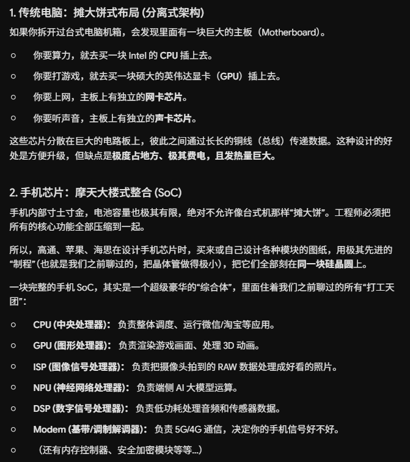
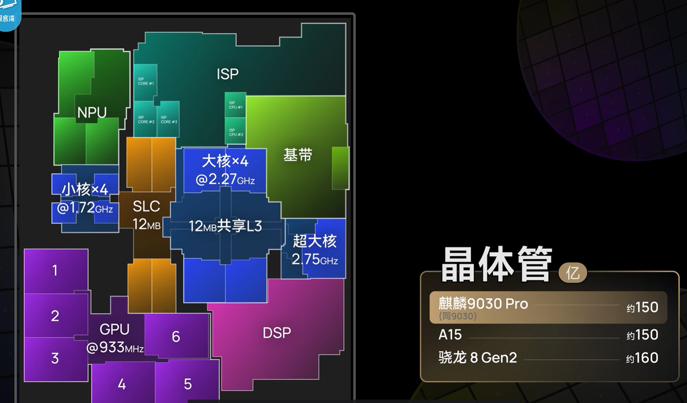
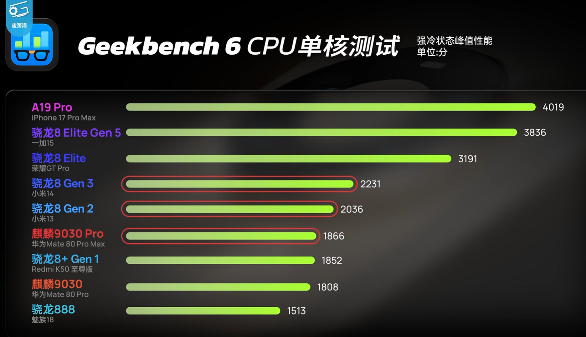
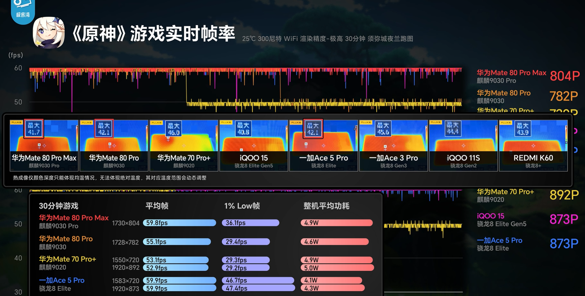

## 前言

看了[极客湾新视频](https://www.bilibili.com/video/BV1F7T46wEyT/)，对于 soc (System on Chip)芯片级别的 架构、优化、涉及到的技术指标，还是一定学习价值的，整理一下。

{}
它根本不是一个单纯的处理器，而是一个把整台计算机的“核心器官”全部打包塞进一块指甲盖大小的硅片里的“微型系统”。
{}

## 基础概念

寄存器深度：是指在数字电路或存储器结构中，能够存储的数据单元（或元素）的 **个数**。

寄存器宽度：每个寄存器能存多少位(bit)的数据。比如常见的 32-bit 或 64-bit

SLC缓存：SLC Cache（SLC缓存）是固态硬盘（SSD）的一项技术，它将TLC或QLC等闪存颗粒划出一部分空间，模拟成读写速度最快的SLC颗粒来工作。这能大幅提升日常文件写入时的速度，但在缓存用尽后速度会降回基础闪存的实际水平。

ISP：图像信号处理器 (Image Signal Processor)，专门处理摄像头影像数据的芯片。

NPU：(Neural Processing Unit) —— 神经网络处理器。如，端侧大模型推理，计算摄影，AI 翻译 / 语音识别使用的芯片。

DSP：(Digital Signal Processor) —— 数字信号处理器，“低功耗信号处理专家”。现实世界的声音、运动、温度都是连续的“模拟信号”，经过转换变成“数字信号”后输入手机。DSP 专门针对这类连续的信号流进行数学变换（比如极其擅长做快速傅里叶变换 FFT、FIR/IIR 滤波）。它的最大特点是极度省电、实时性极强。如，息屏唤醒，音频处理，传感器枢纽。

看完上面概念，就可以大概理解为啥叫 soc 了，有很多专门针对不同细分场景，所特化定制的芯片。

## 当前旗舰 cpu 情况

来自ai：

| 处理器 | 骁龙 8+ Gen 1 | 骁龙 8 Gen 2 | 骁龙 8 Gen 3 | 骁龙 8 Gen 5 |
| :--- | :--- | :--- | :--- | :--- |
| **发布时间** | 2022年5月 | 2022年11月 | 2023年10月 | 2025年11月 |
| **代工工艺** | 台积电 4nm | 台积电 4nm | 台积电 4nm | 台积电 3nm (N3P) |
| **CPU 架构** | 1+3+4 (八核) | 1+4+3 (八核) | 1+5+2 (八核) | 2+6 (八核全大核) |
| **超大核 (X核/Prime)**| 1× Cortex-X2 @ 3.2GHz | 1× Cortex-X3 @ 3.2GHz | 1× Cortex-X4 @ 3.3GHz | 2× Oryon Gen3 @ 3.8GHz |
| **GPU** | Adreno 730 | Adreno 740 (支持光追) | Adreno 750 (支持光追) | 新一代 Adreno 架构 |
| **安兔兔跑分(约)** | 110万 - 120万 | 160万 - 170万 | 200万 - 220万 | 300万 - 350万+ |
| **核心标签** | “救火队长”、性价比之选 | “一代神U”、能效王者 | 性能怪兽、AI 算力爆发 | 纯大核进化、自研架构 |

## 麒麟9030pro

一句话总结：
CPU稳步提升，GPU大幅改进，工艺制程迭代。

{}
制程提升的本质是用更微小的晶体管，在更小的芯片面积上，实现更强悍的计算性能。
{}

1、内部代际(相比麒麟9020) 提升显著，约一倍左右提升。

2、 单核相当于 骁龙8+(gen 1) 水平，和最新旗舰(骁龙8 Elite Gen5)相差一倍。

3、据原神能效测评，游戏能效打赢 8gen3。

{}
软硬协同(软件、OS、芯片层面协同)，huawei 针对不同鸿蒙版的游戏软件做了额外优化。

有各种游戏的原生鸿蒙版本，搞了生态、开发人员投入之后，确实就能干更多的事。
{}