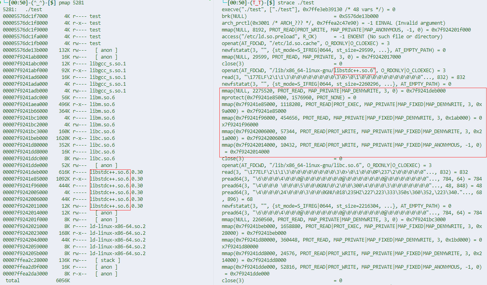

## 前言

读了几篇 syscall 相关的文章，做了一些总结。

用户编写的程序基于用户态库，经历 app -> lib(glibc, musl等) -> syscall用户态内核态接口(会有一些对参数的调用约定，第几个什么形式的参数存在某寄存器中) -> kernel(以中断函数 dispatch 的形式存在，以对应的系统调用号找对应的 handle 函数) 的调用链，最终交给 kernel mode 做一些关键的事情。

什么叫关键的事情？

比如网卡数据，io数据(键盘外设)的处理读写，在硬件之上以驱动的形式处理完，不可能交由用户程序做，不是一件权限上安全的事情。所以交由内核做完，拿给用户程序。

{}
The end goal of writing a kernel is to get to userspace, or, in other words, going from ring 0 to ring 3.
{}

## 用户程序

虚拟地址空间：带访问权限的内存段。

`/proc/:pid/maps` 和 `pmap` 都可以看。

执行一个程序，第一条系统调用是啥？

strace看下，一定是 execve。视进程为状态机 (包括像寄存器，内存等资源) 的话，execve 能初始化一个状态机。

mmap(memory map) 在这个状态机上 增加/删除/修改 一段可访问的内存。核心参数包括：内存段权限设置，MAP 方式(SHARED，PRIVATE)。

典型的例子就是链接器，动态链接库的时候，就是通过 mmap 来做的，如下图所示，可以看到在做一些内存段的映射，和相应的链接库内不同内存段权限的修改。

两个进程需要通信，用 mmap 常见的做法是 将同一个文件映射到他们各自的虚拟地址空间。

映射的内容形式，一般是一个对象，或者说数据结构，此时该文件就成为一个二进制的对象。

两个进程就可以对这个对象进行读写或者别的操作来通信。当然这样并不是线程安全的，需要一些 OS 提供同步原语来控制，比如信号量。

注重性能的场景一般是使用一些无锁队列的数据结构。通过 CAS 原子操作，让 pop 消费线程 或 push 生产线程拿到专属于他(该线程)的下标来做同步控制。

{}
Linux 概念上不对进程、线程做区分，有的只是 task 或者说 执行流的抽象。

线程(通过 clone 或者 vfork 系统调用生成)某种意义上只是轻量级的进程，体现在共享虚拟内存空间，而进程(通过 fork 生成)是有自己独立的页表，独立的虚拟地址空间的。

{}

## performance

这部分几乎没啥用捏？

这篇 [文章 ](http://arkanis.de/weblog/2017-01-05-measurements-of-system-call-performance-and-overhead)，作者使用各种不同的 cpu 硬件平台，编程设置了 benchmark 测试了一些 syscall 的性能开销。

如 getpid() (glibc < 2.25, getpid() is no longer cached by glibc starting with 2.25.)

使用 vDSO(virtual Dynamic Shared Object) 相比普通的 syscall instruction 形式会快很多，非常接近普通函数的调用开销。

但评论似乎也有人说是 glibc cacheing 的功劳。根据 `man getpid` 所说确实如此，所以这次实验只能说明 cacheing 带来的加速。

{}
和 vsyscall 类似，都是一种系统调用加速机制。

将部分内核中 syscall 对应的地址空间通过 `动态共享库 (.so)` 直接映射到用户空间。

vDSO 暴露的系统调用不多，进一步介绍可以在 [文章](https://tinylab.org/riscv-syscall-part3-vdso-overview/) 中找到，是平台而不同的。

如 gettimeofday 。
{}

`ldd  /bin/bash` 可以看到 ELF 链接的共享库情况，其中就有 vDSO，同时可以发现有 ASLR 机制。

fread() 和 fwrite()会比 read() write() 快 8 倍？从 file stream 中进行 IO 操作非常快。

而 vDSO 对 read()，write()几乎没有提升。

